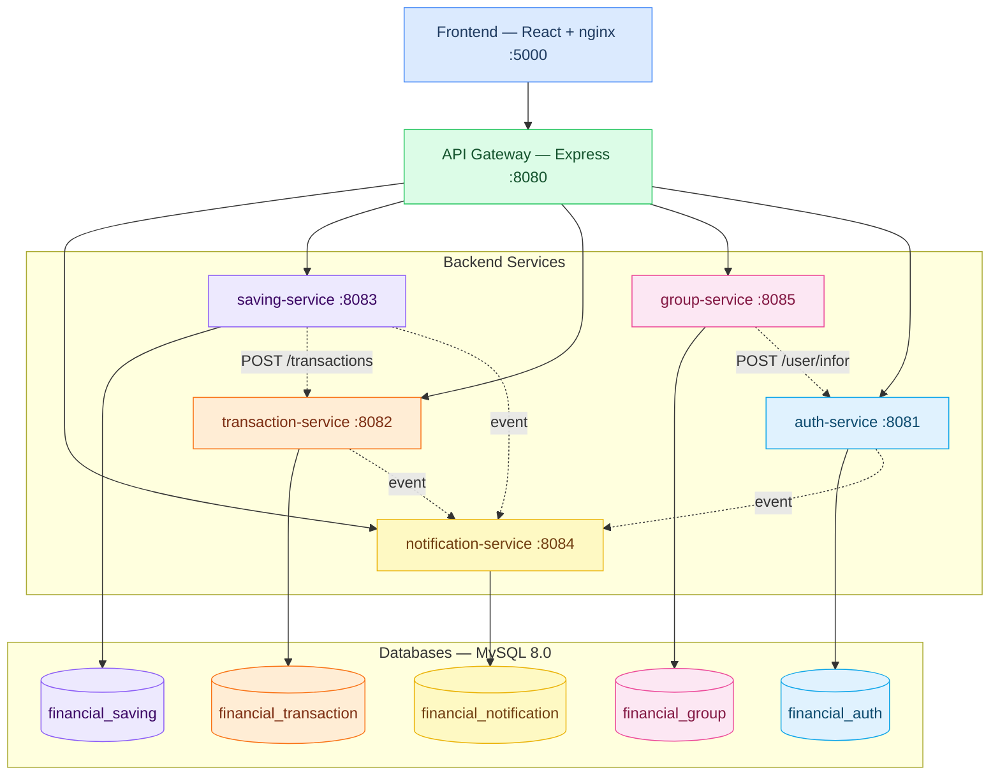

# QUẢN LÝ TÀI CHÍNH

> Hệ thống quản lý tài chính cá nhân theo kiến trúc microservices — theo dõi thu chi cá nhân, thu chi nhóm, kế hoạch tiết kiệm, trả góp và thông báo real-time.

**Repository**: https://github.com/phanduy2310/Financial-Management

---

## Thành viên nhóm

| Name | Student ID | Role | Contribution |
|------|------------|------|--------------|
| Phan Văn Duy | B22DCCN156 | Student | Transaction Service, Group Service |
| Bùi Văn Đạt | B22DCCN180 | Student | Auth Service, Saving Service |
| Trần Đức Hoàng | B22DCCN347 | Student | API Gateway, Notification Service |

---

## 🚀 Demo

**Live**: https://financial-management.up.railway.app

| Tài khoản | Email | Mật khẩu | Vai trò |
|-----------|-------|----------|---------|
| Test User | test@example.com | 123456 | user |

---

## Business Process

Hệ thống hỗ trợ người dùng quản lý tài chính cá nhân theo quy trình:

1. **Đăng ký / Đăng nhập** — xác thực danh tính, liên kết phụ huynh giám sát
2. **Ghi giao dịch** — theo dõi thu nhập và chi tiêu
3. **Nhóm chi tiêu** — theo dõi thu nhập và chi tiêu cho nhiều người
4. **Kế hoạch tiết kiệm** — đặt mục tiêu tích lũy với theo dõi tiến độ
5. **Trả góp** — quản lý các khoản vay theo từng kỳ thanh toán
6. **Thông báo real-time** — nhận thông báo giao dịch, nhắc kế hoạch tiết kiệm, liên kết phụ huynh qua SSE

---

## Kiến trúc hệ thống



| Component | Trách nhiệm | Tech Stack | Port |
|-----------|-------------|------------|------|
| **Frontend** | React SPA — giao diện người dùng | React 19, TailwindCSS, Recharts | 5000 |
| **API Gateway** | Routing, CORS, proxy đến các service | Node.js, Express | 8080 |
| **auth-service** | Đăng ký, đăng nhập, JWT, liên kết phụ huynh | Node.js, Express, Objection.js | 8081 |
| **transaction-service** | Ghi nhận thu chi, quản lý ngân sách | Node.js, Express, Objection.js | 8082 |
| **saving-service** | Kế hoạch tiết kiệm và trả góp | Node.js, Express, Objection.js | 8083 |
| **notification-service** | Thông báo real-time qua SSE | Node.js, Express | 8084 |
| **group-service** | Nhóm chi tiêu, chia bill | Node.js, Express, Objection.js | 8085 |
| **MySQL** | Shared MySQL instance — mỗi service sở hữu một database riêng | MySQL 8.0 | 3306 |

---

## Khởi chạy

### Yêu cầu

- [Docker Desktop](https://www.docker.com/products/docker-desktop/) đang chạy

### Chạy toàn bộ hệ thống

```bash
docker compose up --build
```

Sau khi khởi động xong:

| URL | Mô tả |
|-----|-------|
| http://localhost:5000 | Giao diện người dùng |
| http://localhost:8080/health | API Gateway health check |

> Các backend service (auth, transaction, saving, notification, group) chỉ expose `GET /health` ở cấp container nội bộ — không accessible trực tiếp từ host. Kiểm tra trạng thái bằng `docker compose ps`.

### Thứ tự khởi động

1. `mysql` — chờ healthy (mysqladmin ping)
2. Các backend service (8081–8085) — chạy song song, mỗi service tự migrate DB
3. `gateway` — sau khi tất cả service healthy
4. `frontend` — sau khi gateway sẵn sàng

---

## Tài liệu

| Tài liệu | Mô tả |
|----------|-------|
| [`docs/analysis-and-design-ddd.md`](docs/analysis-and-design-ddd.md) | Phân tích & thiết kế theo DDD |
| [`docs/architecture.md`](docs/architecture.md) | Kiến trúc, patterns, deployment |
| [`docs/api-specs/auth-service.yaml`](docs/api-specs/auth-service.yaml) | OpenAPI — Auth Service |
| [`docs/api-specs/transaction-service.yaml`](docs/api-specs/transaction-service.yaml) | OpenAPI — Transaction Service |
| [`docs/api-specs/saving-service.yaml`](docs/api-specs/saving-service.yaml) | OpenAPI — Saving Service |
| [`docs/api-specs/notification-service.yaml`](docs/api-specs/notification-service.yaml) | OpenAPI — Notification Service |
| [`docs/api-specs/group-service.yaml`](docs/api-specs/group-service.yaml) | OpenAPI — Group Service |
