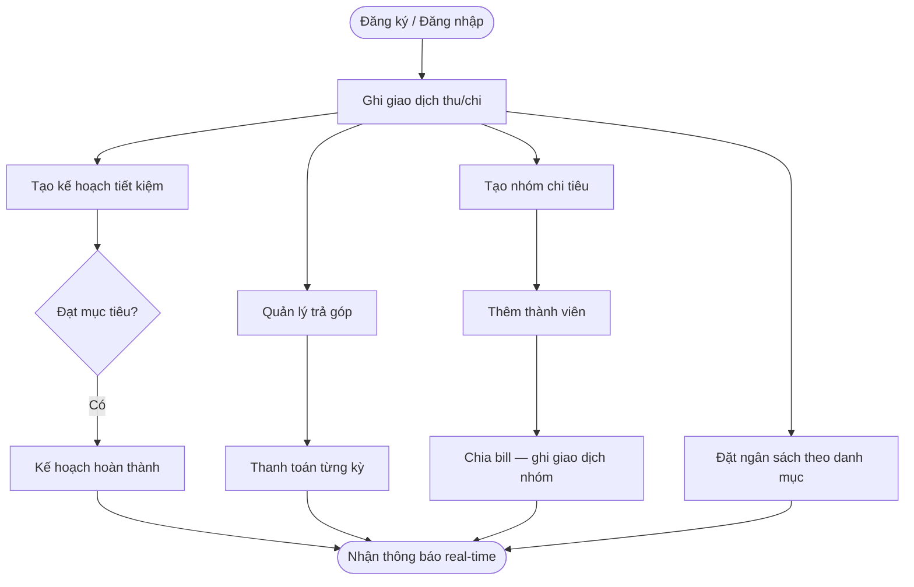
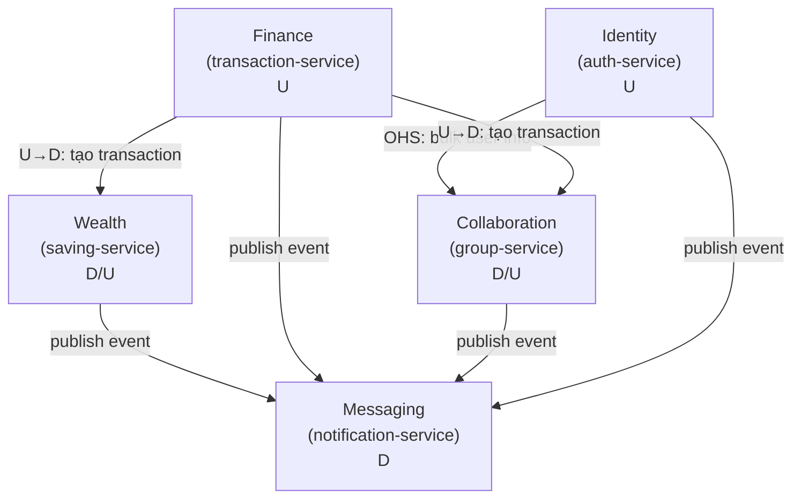
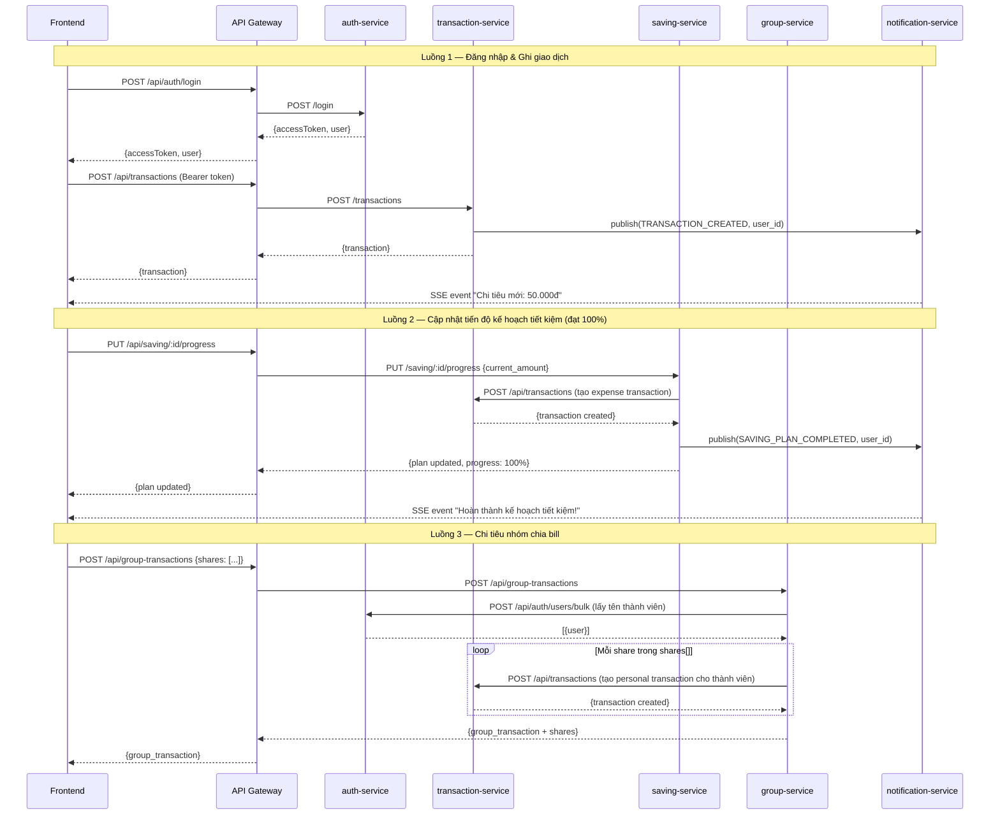
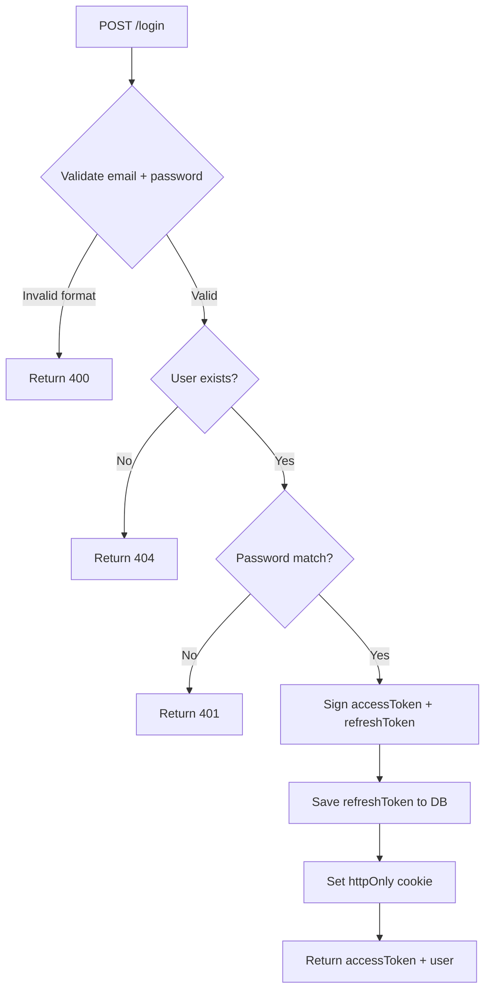
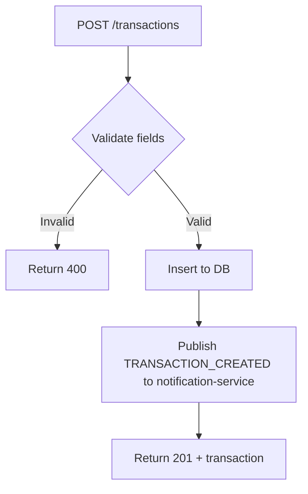
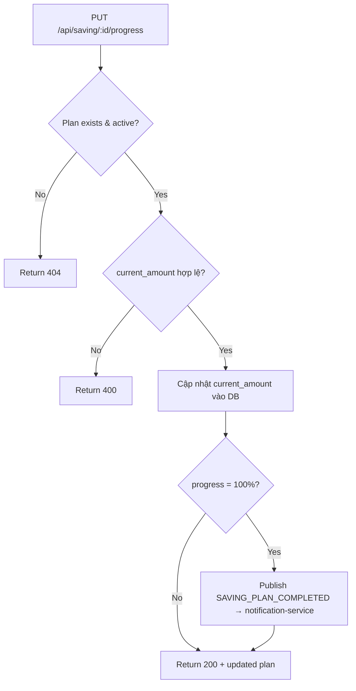
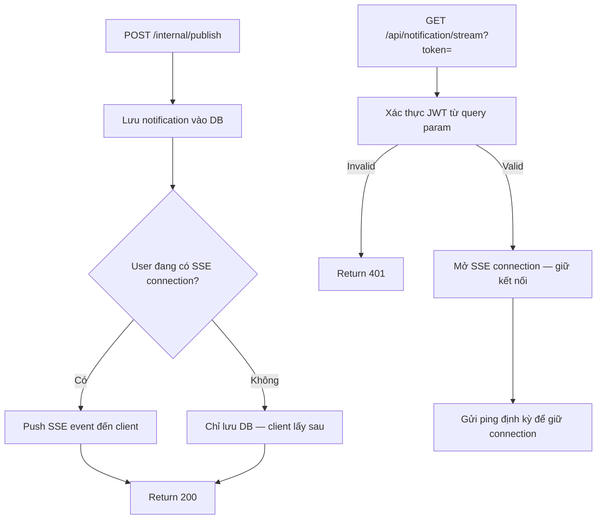
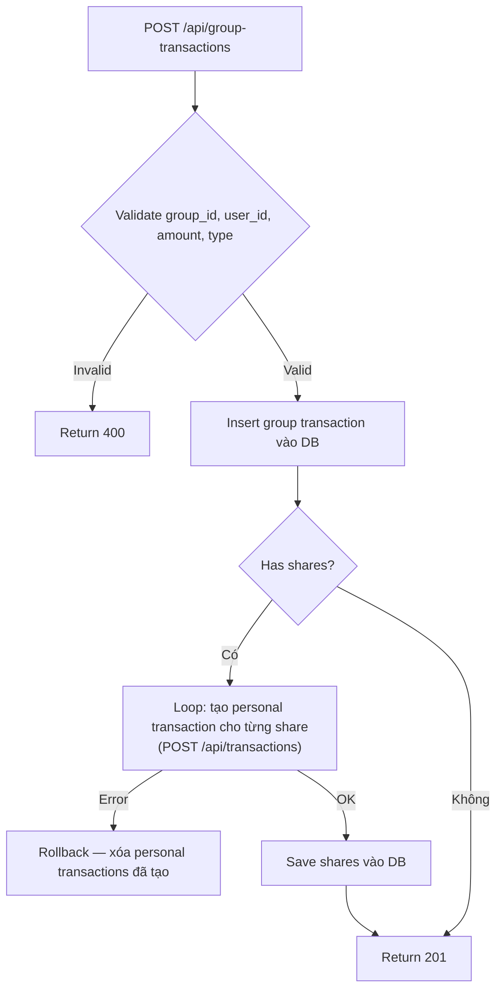

# Analysis and Design — Domain-Driven Design Approach

> **Goal**: Analyze a specific business process and design a service-oriented automation solution using Domain-Driven Design.
> **Scope**: 4–6 week assignment — focus on **one business process**, not an entire system.
>
> **Alternative to**: [`analysis-and-design.md`](analysis-and-design.md) (Step-by-Step Action approach).
> Choose **one** approach, not both. Use this if your team prefers discovering service boundaries through **domain knowledge and business semantics** rather than action decomposition.

**References:**
1. *Domain-Driven Design: Tackling Complexity in the Heart of Software* — Eric Evans
2. *Microservices Patterns: With Examples in Java* — Chris Richardson
3. *Bài tập — Phát triển phần mềm hướng dịch vụ* — Hung Dang (available in Vietnamese)

---

### How DDD differs from Step-by-Step Action

| | Step-by-Step Action | DDD (this document) |
|---|---|---|
| **Thinking direction** | Bottom-up: actions → group → service | Top-down: domain → bounded context → service |
| **Service boundary decided by** | Similarity of actions/functions | Semantic boundary of business domain |
| **Best suited for** | Small–medium systems, simple logic | Complex business logic, ≥ 30 use cases |
| **Key risk** | Services may be fragmented by technical logic | Requires deep domain understanding upfront |

Both approaches lead to a list of services with clear responsibilities. DDD produces services aligned with *business boundaries* — changes in one business area only affect the corresponding service.

### Progression Overview

| Step | What you do | Output |
|------|------------|--------|
| **1.1** | Define the Business Process | Process diagram, actors, scope |
| **1.2** | Survey existing systems | System inventory |
| **1.3** | State non-functional requirements | NFR table |
| **2.1** | Build a shared domain vocabulary | Ubiquitous Language glossary |
| **2.2** | Discover Domain Events via Event Storming | Chronological event list |
| **2.3** | Identify Commands and Actors | Command → Event mapping |
| **2.4** | Form Aggregates from related Commands/Events | Aggregate table with owned data |
| **2.5** | Draw Bounded Contexts around Aggregates | Bounded Context → service candidate |
| **2.6** | Map relationships between Bounded Contexts | Context Map diagram + relationship table |
| **2.7** | Design service interactions | Service composition diagram |
| **3.1** | Specify service contracts | OpenAPI endpoint tables |
| **3.2** | Design internal service logic | Flowchart per service |

---

## Part 1 — Domain Discovery

### 1.1 Business Process Definition

- **Domain**: Quản lý tài chính cá nhân
- **Business Process**: "Người dùng theo dõi thu chi, đặt kế hoạch tiết kiệm, quản lý trả góp và chia sẻ chi tiêu nhóm"
- **Actors**: Người dùng (User), Phụ huynh (Parent — chế độ giám sát)
- **Scope**: Từ khi người dùng đăng ký tài khoản đến khi thực hiện giao dịch, đặt kế hoạch tiết kiệm, trả góp, nhóm chi tiêu và nhận thông báo — không bao gồm tích hợp ngân hàng thực hay xử lý thanh toán thực.

**Process Diagram:**

### 1.2 Existing Automation Systems

| System Name | Type | Current Role | Interaction Method |
|-------------|------|--------------|-------------------|
| Không có | — | Quy trình hiện tại thực hiện thủ công (ghi chép bằng tay hoặc Excel) | — |

> Hệ thống này là giải pháp mới hoàn toàn, không kế thừa hệ thống cũ nào.

### 1.3 Non-Functional Requirements

| Requirement | Description |
|-------------|-------------|
| Performance | API phản hồi < 500ms với tải bình thường; SSE notification real-time |
| Security | JWT access token (15 phút) + refresh token (7 ngày); mật khẩu bcrypt; internal API key giữa các service |
| Scalability | Mỗi service có thể scale độc lập; database schema riêng biệt theo service |
| Availability | Health check mỗi 10 giây; auto-restart container khi lỗi |

---

## Part 2 — Strategic Domain-Driven Design

### 2.1 Ubiquitous Language

| Term | Definition | Example |
|------|-----------|---------|
| **Transaction** | Một bản ghi thu nhập hoặc chi tiêu của người dùng | User ghi nhận chi tiêu 50.000đ cho "Cafe" |
| **Saving Plan** | Kế hoạch tiết kiệm hướng tới một mục tiêu tài chính cụ thể | Tiết kiệm 35.000.000đ để mua iPhone 17 |
| **Installment** | Một khoản vay/trả góp được chia thành nhiều kỳ thanh toán | Vay 5.000.000.000đ trả góp 300 tháng |
| **Installment Period** | Một kỳ thanh toán cụ thể trong kế hoạch trả góp | Kỳ 1 ngày 4/4/2026: trả 30.000.000đ |
| **Group** | Nhóm người dùng cùng quản lý chi tiêu chung | "Con Mèo Béo" — nhóm 3 bạn chung phòng |
| **Group Transaction** | Giao dịch thuộc nhóm, có thể chia cho các thành viên | Chi tiêu "Du lịch" 1.000.000đ chia đều 3 người |
| **Share** | Phần chi tiêu của từng thành viên trong một Group Transaction | Mỗi người chịu 333.333đ |
| **Notification** | Thông báo real-time gửi đến người dùng khi có sự kiện quan trọng | "Kế hoạch tiết kiệm iPhone 17 đã hoàn thành!" |
| **Budget** | Ngân sách chi tiêu theo danh mục trong khoảng thời gian | Tháng 4: giới hạn 2.000.000đ cho "Ăn uống" |
| **Progress** | Tỉ lệ phần trăm hoàn thành của một Saving Plan | 14.57% — đã tích lũy 5.100.000đ / 35.000.000đ |

### 2.2 Event Storming — Domain Events

| # | Domain Event | Description |
|---|-------------|-------------|
| 1 | UserRegistered | Người dùng tạo tài khoản mới thành công |
| 2 | UserLoggedIn | Người dùng đăng nhập, nhận access token + refresh token |
| 3 | TokenRefreshed | Access token hết hạn, được cấp mới qua refresh token |
| 4 | TransactionCreated | Một giao dịch thu hoặc chi được ghi nhận |
| 5 | TransactionUpdated | Thông tin giao dịch được chỉnh sửa |
| 6 | TransactionDeleted | Giao dịch bị xóa khỏi hệ thống |
| 7 | BudgetSet | Người dùng đặt ngân sách cho một danh mục |
| 8 | SavingPlanCreated | Kế hoạch tiết kiệm mới được tạo |
| 9 | SavingProgressUpdated | Tiến độ tích lũy của kế hoạch được cập nhật |
| 10 | SavingPlanCompleted | Kế hoạch tiết kiệm đạt 100% mục tiêu |
| 11 | InstallmentCreated | Kế hoạch trả góp mới được tạo |
| 12 | InstallmentPeriodPaid | Một kỳ trả góp được thanh toán |
| 13 | InstallmentDueSoon | Kỳ trả góp sắp đến hạn (cảnh báo) |
| 14 | GroupCreated | Nhóm chi tiêu mới được tạo |
| 15 | MemberAdded | Thành viên mới tham gia nhóm |
| 16 | MemberRemoved | Thành viên rời khỏi nhóm |
| 17 | GroupTransactionCreated | Giao dịch nhóm được ghi nhận và chia tiền |
| 18 | NotificationPublished | Thông báo được gửi đến người dùng qua SSE |
| 19 | ParentLinked | Phụ huynh liên kết để theo dõi chi tiêu con |

### 2.3 Commands and Actors

| Command | Actor | Triggers Event(s) | Description |
|---------|-------|--------------------|-------------|
| RegisterUser | User | UserRegistered | Tạo tài khoản với email, mật khẩu, họ tên |
| LoginUser | User | UserLoggedIn | Đăng nhập, trả về access + refresh token |
| RefreshToken | System | TokenRefreshed | Làm mới access token qua cookie refresh token |
| CreateTransaction | User | TransactionCreated, NotificationPublished | Ghi nhận thu/chi với danh mục, số tiền, ngày |
| UpdateTransaction | User | TransactionUpdated | Chỉnh sửa thông tin giao dịch |
| DeleteTransaction | User | TransactionDeleted | Xóa giao dịch |
| SetBudget | User | BudgetSet | Đặt giới hạn ngân sách theo danh mục |
| CreateSavingPlan | User | SavingPlanCreated | Tạo kế hoạch tiết kiệm mới |
| UpdateSavingProgress | User | SavingProgressUpdated, SavingPlanCompleted, NotificationPublished | Cập nhật số tiền đã tích lũy |
| CreateInstallment | User | InstallmentCreated | Tạo kế hoạch trả góp |
| PayInstallmentPeriod | User | InstallmentPeriodPaid, TransactionCreated | Thanh toán một kỳ trả góp |
| CreateGroup | User | GroupCreated | Tạo nhóm chi tiêu mới |
| AddGroupMember | User (Owner) | MemberAdded | Thêm thành viên vào nhóm |
| RemoveGroupMember | User (Owner) | MemberRemoved | Xóa thành viên khỏi nhóm |
| CreateGroupTransaction | User | GroupTransactionCreated, TransactionCreated | Tạo giao dịch nhóm và chia tiền |
| LinkParent | User/Parent | ParentLinked, NotificationPublished | Phụ huynh liên kết với tài khoản con |

### 2.4 Aggregates

| Aggregate | Root Entity | Commands | Domain Events | Key Business Rules |
|-----------|------------|----------|---------------|--------------------|
| **User** | User | RegisterUser, LoginUser, RefreshToken, LinkParent | UserRegistered, UserLoggedIn, TokenRefreshed, ParentLinked | Email phải duy nhất; mật khẩu >= 6 ký tự |
| **Transaction** | Transaction | CreateTransaction, UpdateTransaction, DeleteTransaction | TransactionCreated, TransactionUpdated, TransactionDeleted | Amount > 0; type phải là "income" hoặc "expense" |
| **Budget** | Budget | SetBudget | BudgetSet | Budget gắn với user_id + category + tháng/năm |
| **SavingPlan** | SavingPlan | CreateSavingPlan, UpdateSavingProgress | SavingPlanCreated, SavingProgressUpdated, SavingPlanCompleted | current_amount không vượt target_amount; progress 0–100% |
| **Installment** | Installment | CreateInstallment, PayInstallmentPeriod | InstallmentCreated, InstallmentPeriodPaid, InstallmentDueSoon | paid_amount <= total_amount; kỳ thanh toán tuần tự |
| **Group** | Group | CreateGroup, AddGroupMember, RemoveGroupMember | GroupCreated, MemberAdded, MemberRemoved | Chỉ owner mới có quyền thêm/xóa thành viên |
| **GroupTransaction** | GroupTransaction | CreateGroupTransaction | GroupTransactionCreated | Tổng shares phải bằng total amount của giao dịch |
| **Notification** | Notification | (triggered by other services) | NotificationPublished | Thông báo gửi theo event type; SSE stream per user |

### 2.5 Bounded Contexts

| Bounded Context | Aggregates Included | Responsibility | Service Candidate |
|-----------------|---------------------|----------------|-------------------|
| **Identity** | User | Quản lý danh tính, xác thực, phân quyền, liên kết phụ huynh | auth-service |
| **Finance** | Transaction, Budget | Ghi nhận thu chi cá nhân, quản lý ngân sách | transaction-service |
| **Wealth** | SavingPlan, Installment | Kế hoạch tiết kiệm và quản lý trả góp | saving-service |
| **Collaboration** | Group, GroupTransaction | Nhóm chi tiêu chung, chia bill | group-service |
| **Messaging** | Notification | Thông báo real-time qua SSE | notification-service |

### 2.6 Context Map

> **Ghi chú ký hiệu:** U = Upstream (cung cấp), D = Downstream (phụ thuộc), D/U = vừa là downstream (phụ thuộc Finance/Identity) vừa là upstream (cung cấp event cho Messaging).

| Upstream | Downstream | Relationship Type | Data Exchanged |
|----------|------------|-------------------|----------------|
| Identity (auth-service) | Collaboration (group-service) | Open Host Service (OHS) | user_id, fullname, email — group-service gọi `/users/bulk` |
| Finance (transaction-service) | Wealth (saving-service) | Upstream / Downstream | transaction payload — saving-service tạo expense khi đóng góp/trả góp |
| Finance (transaction-service) | Collaboration (group-service) | Upstream / Downstream | transaction payload — group-service tạo expense khi chia bill |
| Identity, Finance, Wealth, Collaboration | Messaging (notification-service) | Event Publisher / Subscriber (fire-and-forget) | {user_id, type, message} qua POST /internal/publish |

### 2.7 Service Composition

---

## Part 3 — Service-Oriented Design

### 3.1 Uniform Contract Design

Full OpenAPI specs:
- [`docs/api-specs/auth-service.yaml`](api-specs/auth-service.yaml)
- [`docs/api-specs/transaction-service.yaml`](api-specs/transaction-service.yaml)
- [`docs/api-specs/saving-service.yaml`](api-specs/saving-service.yaml)
- [`docs/api-specs/notification-service.yaml`](api-specs/notification-service.yaml)
- [`docs/api-specs/group-service.yaml`](api-specs/group-service.yaml)

**auth-service — Identity Context:**

| Endpoint | Method | Description | Request Body | Response Codes |
|----------|--------|-------------|--------------|----------------|
| /health | GET | Health check (internal) | — | 200 |
| /api/auth/register | POST | Đăng ký tài khoản | {fullname, email, password} | 201, 400 |
| /api/auth/login | POST | Đăng nhập | {email, password} | 200, 401 |
| /api/auth/refresh | POST | Làm mới access token | — (cookie) | 200, 401 |
| /api/auth/logout | POST | Đăng xuất | — | 200 |
| /api/auth/me | GET | Lấy thông tin người dùng hiện tại | — | 200, 401 |
| /api/auth/users/find | GET | Tìm user theo email | ?email= | 200, 404 |
| /api/auth/users/bulk | POST | Lấy thông tin nhiều user (internal) | {ids: []} | 200 |
| /api/auth/users/:id | GET | Lấy thông tin user theo ID | — | 200, 404 |
| /api/parent/children | POST | Thêm con theo email (phụ huynh) | {email} | 200, 404 |
| /api/parent/children | GET | Lấy danh sách con (phụ huynh) | — | 200 |
| /api/parent/confirm | POST | Con xác nhận liên kết | {token} | 200 |

**transaction-service — Finance Context:**

| Endpoint | Method | Description | Request Body | Response Codes |
|----------|--------|-------------|--------------|----------------|
| /health | GET | Health check (internal) | — | 200 |
| /api/transactions | POST | Tạo giao dịch | {user_id, type, category, amount, date, note} | 200, 400 |
| /api/transactions/:user_id | GET | Lấy danh sách giao dịch của user | — | 200 |
| /api/transactions/detail/:id | GET | Chi tiết giao dịch | — | 200, 404 |
| /api/transactions/:id | PUT | Cập nhật giao dịch | {category, amount, date, note} | 200, 404 |
| /api/transactions/:id | DELETE | Xóa giao dịch | — | 200, 404 |
| /api/transactions/stats | POST | Thống kê theo tháng | {user_id, month, year} | 200 |
| /api/transactions/stats/summary/:userId | GET | Tổng quan thu/chi/số dư | — | 200 |
| /api/budget | POST | Tạo ngân sách | {user_id, category, limit_amount} | 200, 400 |
| /api/budget/:userId | GET | Lấy ngân sách của user | — | 200 |
| /api/budget/:id | PATCH | Cập nhật ngân sách | — | 200, 404 |
| /api/budget/:id | DELETE | Xóa ngân sách | — | 200 |

**saving-service — Wealth Context:**

| Endpoint | Method | Description | Request Body | Response Codes |
|----------|--------|-------------|--------------|----------------|
| /health | GET | Health check (internal) | — | 200 |
| /api/saving | POST | Tạo kế hoạch tiết kiệm | {user_id, title, target_amount} | 201, 400 |
| /api/saving/:user_id | GET | Lấy danh sách kế hoạch | — | 200 |
| /api/saving/:user_id/stats | GET | Thống kê tiết kiệm | — | 200 |
| /api/saving/:id/progress | PUT | Cập nhật tiến độ | {current_amount} | 200, 404 |
| /api/saving/:id/complete | PUT | Đánh dấu hoàn thành | — | 200, 404 |
| /api/saving/:id | PUT | Cập nhật thông tin kế hoạch | — | 200, 404 |
| /api/saving/:id | DELETE | Xóa kế hoạch | — | 200 |
| /api/installment | POST | Tạo kế hoạch trả góp | {user_id, title, total_amount, monthly_payment} | 201 |
| /api/installment/:user_id | GET | Lấy danh sách trả góp | — | 200 |
| /api/installment/:id/pay | PATCH | Thanh toán kỳ trả góp | {amount} | 200, 404 |
| /api/installment/:id/update | PATCH | Cập nhật thông tin trả góp | — | 200 |
| /api/installment/:id | DELETE | Xóa kế hoạch trả góp | — | 200 |

**notification-service — Messaging Context:**

| Endpoint | Method | Description | Request Body | Response Codes |
|----------|--------|-------------|--------------|----------------|
| /health | GET | Health check (internal) | — | 200 |
| /api/notification/stream | GET | SSE stream — token qua `?token=<jwt>` | — | 200 (stream) |
| /api/notification | GET | Lấy danh sách thông báo | — | 200 |
| /api/notification/unread-count | GET | Đếm thông báo chưa đọc | — | 200 |
| /api/notification/:id/read | POST | Đánh dấu đã đọc | — | 200 |
| /internal/publish | POST | Publish event (x-internal-key header) | {event, user_id, channels, source_service, payload} | 200 |

**group-service — Collaboration Context:**

| Endpoint | Method | Description | Request Body | Response Codes |
|----------|--------|-------------|--------------|----------------|
| /health | GET | Health check (internal) | — | 200 |
| /api/groups | POST | Tạo nhóm | {name, description, owner_id} | 200, 400 |
| /api/groups/user/:user_id | GET | Lấy nhóm của user | — | 200 |
| /api/groups/:id | PATCH | Cập nhật thông tin nhóm | {name, description} | 200, 404 |
| /api/groups/:id | DELETE | Xóa nhóm | — | 200 |
| /api/group-members/:group_id | GET | Lấy thành viên nhóm | — | 200 |
| /api/group-members/add | POST | Thêm thành viên | {group_id, user_id} | 200, 409 |
| /api/group-members/remove | POST | Xóa thành viên | {group_id, user_id} | 200 |
| /api/group-transactions | POST | Tạo giao dịch nhóm + chia tiền | {group_id, user_id, type, amount, shares} | 200 |
| /api/group-transactions/:group_id | GET | Lấy giao dịch nhóm | — | 200 |
| /api/group-transactions/detail/:transaction_id | GET | Chi tiết giao dịch + shares | — | 200, 404 |
| /api/group-transactions/:group_id/summary | GET | Tổng kết thu/chi nhóm | — | 200 |

### 3.2 Service Logic Design

**auth-service — Login flow:**

**transaction-service — Create transaction flow:**

**saving-service — Update saving plan progress flow:**

**notification-service — Publish & push SSE flow:**

**group-service — Create group transaction flow:**

