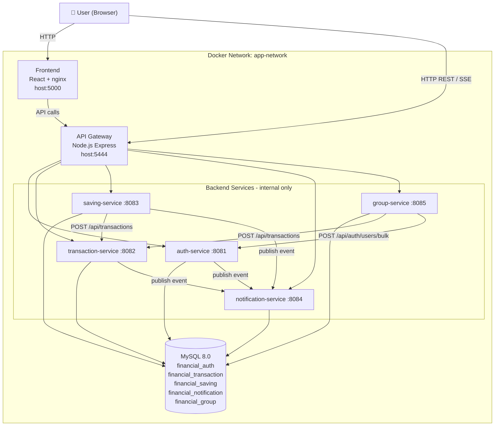

# System Architecture

## 1. Pattern Selection

| Pattern | Selected? | Business/Technical Justification |
|---------|-----------|----------------------------------|
| **API Gateway** | ✅ Yes | Tập trung routing, CORS, xác thực tại một điểm — frontend không gọi trực tiếp vào service |
| **Database per Service** | ✅ Yes | Mỗi service sở hữu schema riêng trong MySQL — thay đổi schema của service này không ảnh hưởng service khác |
| **Shared Database** | ⚠️ Partial | Dùng 1 MySQL instance nhưng mỗi service có database riêng (financial_auth, financial_transaction, v.v.) |
| **Saga** | ❌ No | Không dùng distributed transaction; thay bằng rollback thủ công khi lỗi (compensating transaction) |
| **Event-driven / Message Queue** | ⚠️ Partial | Fire-and-forget HTTP call thay vì message queue — đủ cho phạm vi bài tập |
| **CQRS** | ❌ No | Không tách read/write — không cần thiết ở quy mô này |
| **Circuit Breaker** | ❌ No | Chưa implement — service lỗi sẽ trả error về client |
| **Service Registry / Discovery** | ❌ No | Dùng Docker Compose DNS thay thế (tên service = hostname) |
| **SSE (Server-Sent Events)** | ✅ Yes | Real-time notification một chiều từ server đến client — đơn giản hơn WebSocket |

---

## 2. System Components

| Component | Responsibility | Tech Stack | Port (host) | Port (container) |
|-----------|----------------|------------|-------------|------------------|
| **Frontend** | React SPA — giao diện người dùng, gọi API qua Gateway | React 19, TailwindCSS, Recharts | 5000 | 3000 (nginx) |
| **Gateway** | Routing, CORS, proxy đến các service | Node.js, Express, axios | 5444 | 5444 |
| **auth-service** | Đăng ký, đăng nhập, JWT, liên kết phụ huynh | Node.js, Express, Objection.js, bcrypt | — | 8081 |
| **transaction-service** | Ghi nhận thu chi | Node.js, Express, Objection.js | — | 8082 |
| **saving-service** | Kế hoạch tiết kiệm, trả góp | Node.js, Express, Objection.js | — | 8083 |
| **notification-service** | Thông báo real-time qua SSE | Node.js, Express | — | 8084 |
| **group-service** | Nhóm chi tiêu, chia bill | Node.js, Express, Objection.js | — | 8085 |
| **MySQL** | Shared MySQL instance — mỗi service sở hữu một database riêng (financial_auth, financial_transaction, financial_saving, financial_notification, financial_group) | MySQL 8.0 | — | 3306 |

> Các service backend (8081–8085) không expose port ra host — chỉ accessible nội bộ qua Docker network.

---

## 3. Communication

### Inter-service Communication Matrix

| From → To | auth | transaction | saving | notification | group | gateway | mysql |
|-----------|------|-------------|--------|--------------|-------|---------|-------|
| **Frontend** | — | — | — | SSE stream | — | HTTP REST | — |
| **Gateway** | HTTP proxy | HTTP proxy | HTTP proxy | HTTP proxy | HTTP proxy | — | — |
| **auth-service** | — | — | — | HTTP (publish) | — | — | ✅ |
| **transaction-service** | — | — | — | HTTP (publish) | — | — | ✅ |
| **saving-service** | — | HTTP (create tx) | — | HTTP (publish) | — | — | ✅ |
| **notification-service** | — | — | — | — | — | — | ✅ |
| **group-service** | HTTP (bulk users) | HTTP (create tx) | — | — | — | — | ✅ |

**Ghi chú:**
- `HTTP proxy`: Gateway forward toàn bộ request từ frontend
- `HTTP (publish)`: Fire-and-forget POST đến `/internal/publish` của notification-service
- `HTTP (create tx)`: Tạo transaction cá nhân khi saving/installment/group-transaction hoàn thành
- `HTTP (bulk users)`: group-service gọi auth-service để lấy tên người dùng khi enrich dữ liệu

---

## 4. Architecture Diagram



---

## 5. Deployment

- Tất cả service được container hóa với **Docker**
- Orchestration bằng **Docker Compose** — single command:

```bash
docker compose up --build
```

**Startup order** (depends_on + healthcheck):
1. `mysql` — healthcheck: mysqladmin ping (interval 5s, retries 20)
2. `auth-service`, `transaction-service`, `saving-service`, `notification-service`, `group-service` — song song sau khi MySQL healthy; mỗi service chạy `npx knex migrate:latest` trước khi start
3. `gateway` — sau khi tất cả 5 service healthy
4. `frontend` — sau khi gateway sẵn sàng

**Network**: Tất cả service trong `app-network` (bridge) — giao tiếp qua Docker DNS service name

**Data persistence**: MySQL data lưu vào Docker volume `mysql-data`

